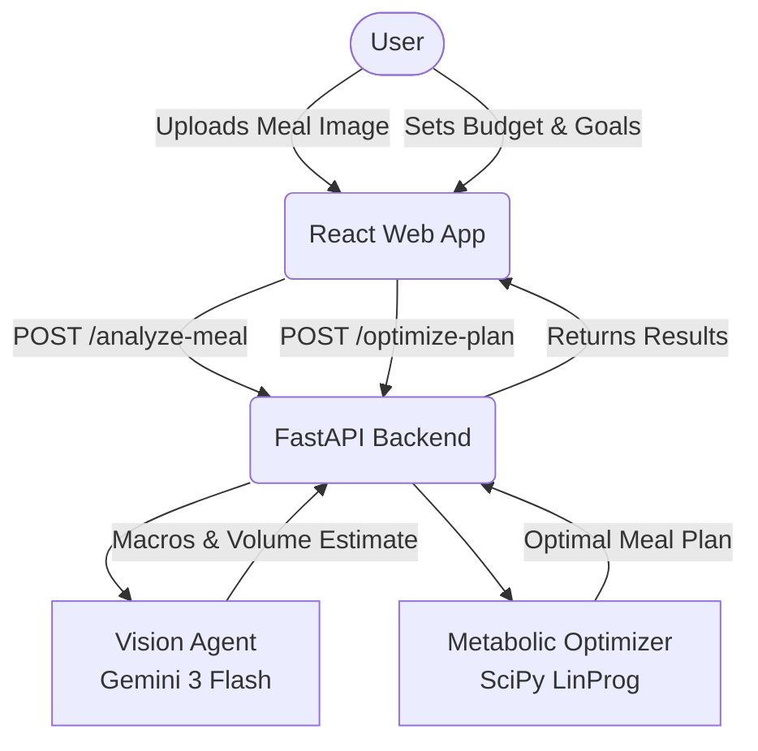

# AuraHealth AI

AuraHealth AI is a web-first application acting as a smart nutrition and metabolic tracking platform.

## Agentic Data Flow

## Metabolic Optimizer Objective Function

The optimizer utilizes linear programming to solve the meal plan generation.

**Objective:** Minimize the nutritional gap from target macros.
$$ \min \sum_{i} | x_{i} \cdot N_{i} - T | $$
where:
- $x_{i}$ is the quantity of food item $i$.
- $N_{i}$ is the nutritional profile of item $i$.
- $T$ is the target nutritional profile.

**Subject to Constraints:**
1. $\sum (x_{i} \cdot C_{i}) \le B$ (Cost constraint: Total cost must be less than or equal to Budget $B$)
2. $\sum (x_{i} \cdot GI_{i}) \le G_{max}$ (Glycemic constraint: Total glycemic load must be less than max $G_{max}$)

## Deployment

This application is deployed automatically to Google Cloud Run via GitHub Actions on every push to the `main` branch.
